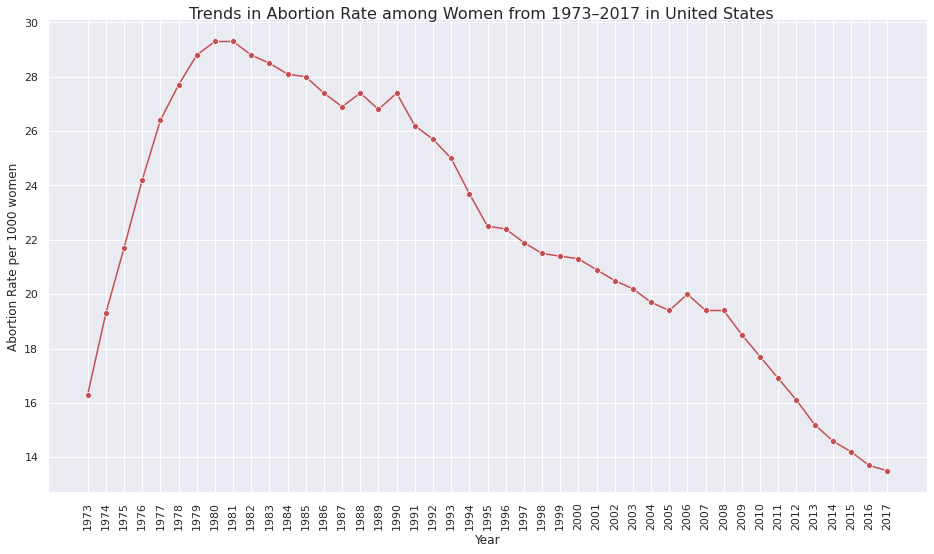
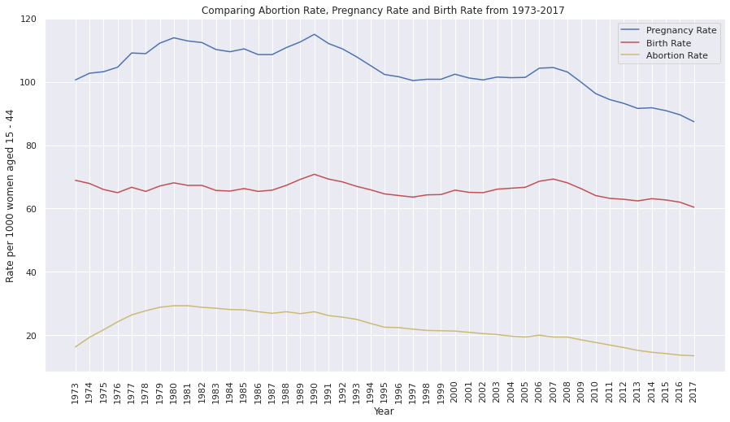
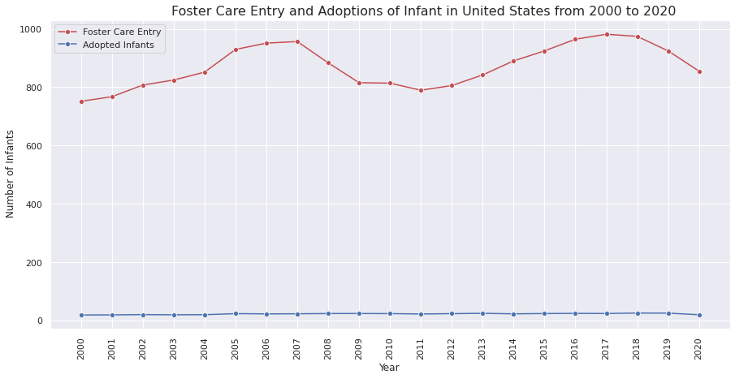
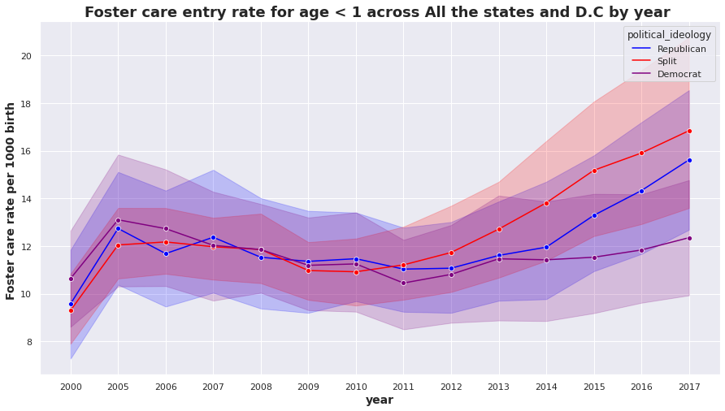
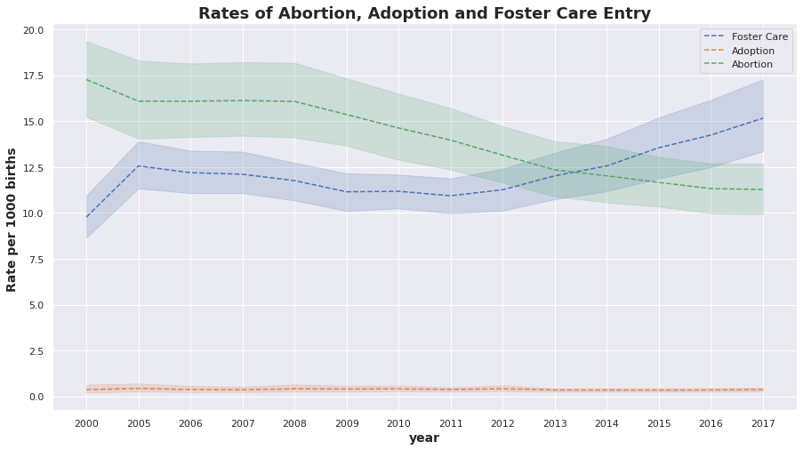
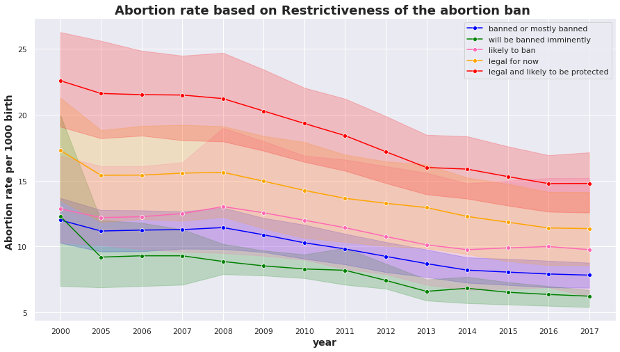
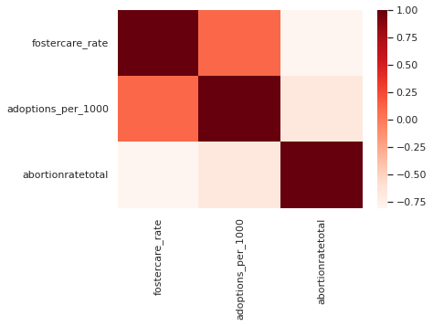

# **Impact of Abortion ban in Foster care system based on political Ideology and Restrictiveness of Abortion Bans**

# Use Case
On June 24, 2022, the U.S. Supreme Court overturned Roe v. Wade, ending the constitutional right to an abortion. This will impact public health, access to education and the general economy. Proponents of overturning Roe have proposed adoption as an alternative to abortion, but there is a political debate about whether increasing the number of unwanted births will lead to increased numbers of children left behind in the foster care system. 
This project takes a dive into the impact that restrictive abortion laws have on the US foster care system.

# Overview 
This project focuses on:
 * Exploring the relationship between abortion rates and foster care entry rates for infants
 * Understanding the impact of abortion laws (and therefore, state’s political ideology) on rates of abortion, foster care entry, and adoption
 * Determining what factors contribute to an increase/decrease of foster care entry rates
 
Methodology / Analytic Technique:
  * Descriptive analysis
  * Time series analysis
  * Correlation Analysis
  * Hypothesis Testing

# Data Understanding
**Abortions dataset** :  (https://osf.io/kthnf/)
Comprehensive historical statistics on the incidence of pregnancy, birth and abortion for people of all reproductive ages in the US, state-level (1988-2017).

**Foster Care & Adoptions** : (https://datacenter.kidscount.org/)
Number of US children, broken down by age groups, who have entered foster care and/or been adopted by year and state in 2000-2020.

**Political Idelogy** :
The data is split into three groups - Republican, Split and Democrat

**Restrictiveness of abortion ban** : (https://www.washingtonpost.com/politics/2022/06/24/abortion-state-laws-criminalization-roe/)
grouping states based on severity of adoption ban 1-5 scale, 1 - banned or mostly banned, 2 - will be banned imminently, 3 - likely to ban, 4 - legal for now, 5 - legal and likely to be protected

# Data preparation 
 * All the datasets have been cleaned and merged based on state codes and year
 * Created KPI's using multiple datasets - Fostercare entry rate for infants (foster care entry /birthtotal)/1000 and Adoption rate (adoption number/birthtotal)/1000 for infants <1 
 * Missing data that were not recorded for all the states are dropped
 * Missing data for certain years are imputed based on "MODE" using SimpleImputer Function

# Abortion Data Analysis

**There is a downward trend in the abortion rates in the US since 1981**

# Foster Care Entry and Adoption Data Analysis

 * **There is a huge difference between the number of infants entering faster care and number of infants getting adopted**

 * **W**

# Bringing it all together

# Results & Findings

**How do restrictive abortion laws impact rates of abortion, foster
care entry, and adoption?**

As the abortion laws become more restrictive…

 * Rate of (legal) abortions decreases

 * Rate at which infants enter foster care increases

 * Rate of adoptions decreases

